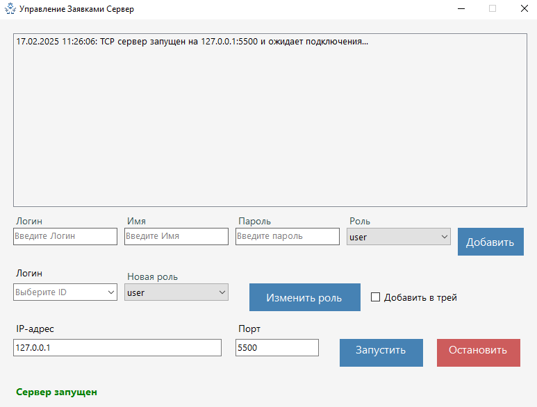
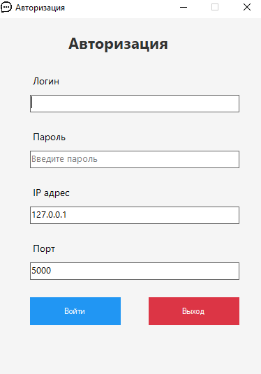
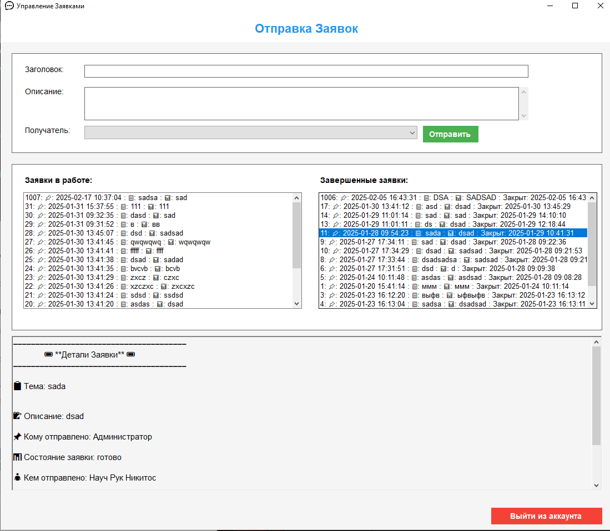
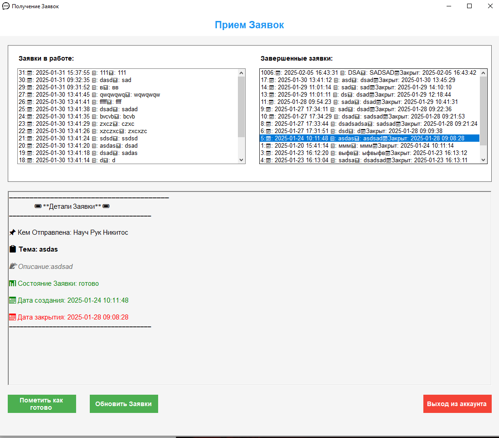

# Клиент-Серверная Система Управления Заявками  
Клиент-серверное приложение для управления заявками, использующее TCP/IP на C# (.NET Framework 4.8).

   
<b>Требования</b>  
<ul>
  <li>Visual Studio 2022</li>
  <li>.NET Framework 4.8</li>
  <li>SQL Server 2022</li>
  <li>Рекомендуемое разрешение экрана: 1920x1080</li>
</ul>  

   
<b>Установка и запуск</b>  
<ul>
  <li>Импортировать базу данных из <code>Database/TicketSystem.bak</code></li>
  <li>Настроить подключение к базе данных в <code>App.config</code> (или в коде)</li>
  <li>Скомпилировать серверную часть <code>TicketSystemServer.sln</code></li>
  <li>Скомпилировать клиентскую часть <code>TicketSystemClient.sln</code></li>
</ul>  
<b>Превью</b>  

     
    <b>Сервер</b>

     
    <b>Клиент: Авторизация</b>

     
    <b>Клиент: Отправка заявки</b>

     
    <b>Клиент: Просмотр заявок</b>

  

   
<b>Примечание</b>  
Строка подключения к базе данных (по умолчанию в коде):  
   
<code>Data Source=localhost;Initial Catalog=TicketSystem;Integrated Security=True;</code>  
